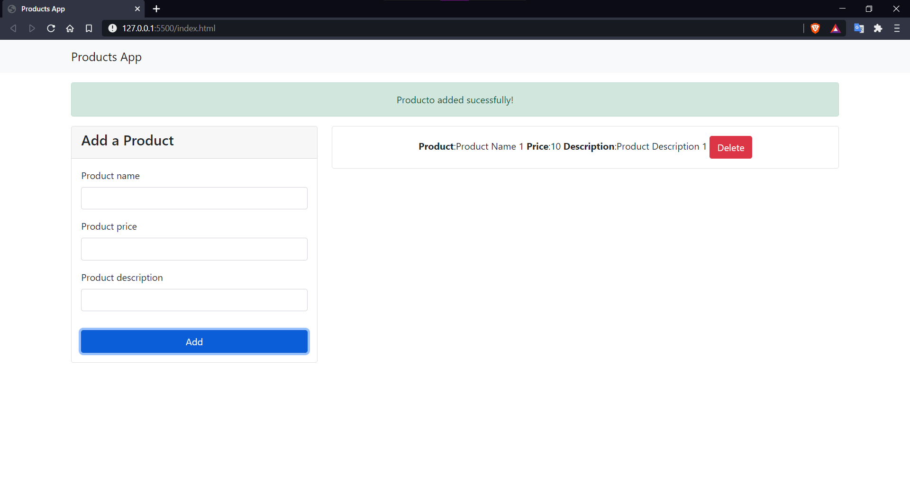
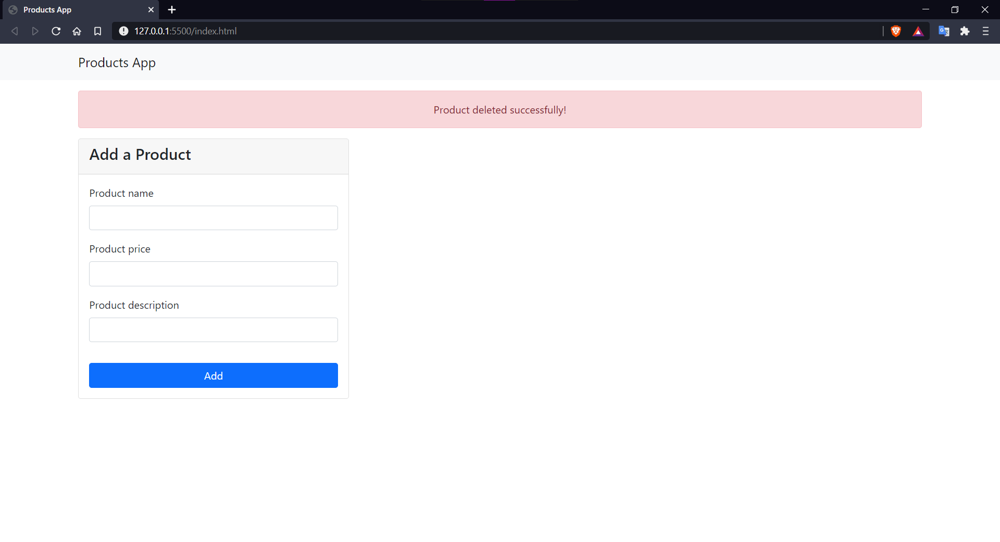

# Products-App 🛒

## Instalacion⚙️

- Este proyecto no requiere la instalacion de ningun programa extra.

## Recomendacion👾

- Ejecutar en un server local, recomiendo la extencion [Live Server](https://marketplace.visualstudio.com/items?itemName=ritwickdey.LiveServer)

## Introduccion🧠

- En este proyecto encontraremos un programa el cual nos permite añadir y quitar productos mediante la utilizacion del paradigma orientado a objetos.

## Screenshots📸

## Prueba 🎮

[Click aqui](https://juan-chapur.github.io/Products-App/) para probar :D
